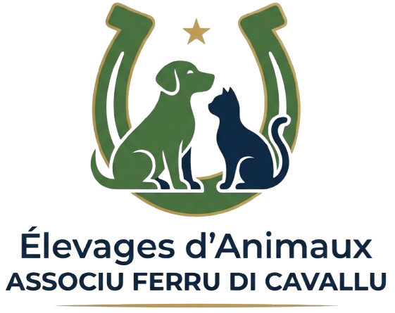

# élevages d'animaux ASSOCIU FERRU DI CAVALLU



## Description

élevages d'animaux ASSOCIU FERRU DI CAVALLU est une application Laravel 12 pour un site multilingue de présentation et de vente de chiens. Le projet propose une page d'accueil avec chiots mâles et femelles, des fiches détaillées par chiot, un filtrage par race, une page de vente, une recherche avec suggestions et un formulaire de commande par email.

## Fonctionnalités principales

- Site multilingue avec sélection de langue via le préfixe d'URL.
- Page d'accueil dynamique affichant les chiots mâles et femelles.
- Pages de détails de chiots accessibles par slug.
- Pages de race qui listent tous les chiots d'une race donnée.
- Page de vente avec pagination et filtres de race.
- Recherche de chiots par nom, race et description.
- Autocomplétion de recherche et détails de race via AJAX.
- Formulaire de commande qui envoie un email de confirmation au client et une notification à l'administrateur.
- Pages statiques : Qui sommes-nous, Envoi, Garantie sanitaire, Références, Contact, Politique de confidentialité, Politique de retour, Cookies.

## Architecture du projet

- `app/Http/Controllers/CachorroController.php` : contrôleur principal gérant l'affichage des pages, la recherche, l'autocomplétion et le traitement des commandes.
- `app/Repositories/ChiosRepository.php` et `app/Repositories/CachorroRepository*.php` : gestion des données des chiots à partir de configurations.
- `app/Http/Requests/OrderRequest.php` : validation des données du formulaire de commande.
- `app/Mail/OrderConfirmationMail.php` : message email de confirmation pour le client et l'administrateur.
- `routes/web.php` : routes publiques et multilingues.
- `resources/views/` : vues Blade pour l'interface utilisateur.
- `public/assets/logo/` : logo du site et favicon.
- `config/` : configuration de l'application et listes de races / chiens.

## Pages et routes importantes

- `/{lang}` : page d'accueil.
- `/{lang}/cachorros-disponibles/{slug}` : fiche détaillée d'un chiot.
- `/{lang}/chiens.par-race/{slug}` : liste des chiots par race.
- `/{lang}/cachorros-en-venta` : page de vente principale.
- `/search` : recherche de chiens.
- `/search/autocomplete` : autocomplétion de recherche.
- `/search/race-details` : chargement des détails d'une race.
- `/{lang}/order/{slug}` : envoi de commande.
- Pages statiques : `quienes-somos`, `envio-de-cachorros`, `garantia-sanitaria`, `referencias`, `contacto`, `politica-de-privacidad`, `politica-de-devoluciones`, `politica-de-cookies`.

## Prérequis

- PHP 8.2 ou supérieur.
- Composer.
- Node.js et npm.
- Base de données MySQL / MariaDB / SQLite / autre supporté par Laravel.
- Serveur web local (Apache, Nginx) ou `php artisan serve`.

## Installation sur une autre machine

1. Cloner le dépôt :

```bash
git clone <url-du-repo>
cd élevages d'animaux ASSOCIU FERRU DI CAVALLU
```

2. Installer les dépendances PHP :

```bash
composer install
```

3. Copier le fichier d'environnement :

```bash
cp .env.example .env
```

4. Configurer le fichier `.env` :

- `APP_NAME`, `APP_URL`
- `DB_CONNECTION`, `DB_HOST`, `DB_PORT`, `DB_DATABASE`, `DB_USERNAME`, `DB_PASSWORD`
- `MAIL_MAILER`, `MAIL_HOST`, `MAIL_PORT`, `MAIL_USERNAME`, `MAIL_PASSWORD`, `MAIL_ENCRYPTION`, `MAIL_FROM_ADDRESS`
- `ADMIN_EMAIL` pour recevoir les notifications de commande.

5. Générer la clé de l'application :

```bash
php artisan key:generate
```

6. Créer la base de données et lancer les migrations :

```bash
php artisan migrate
```

7. Installer les dépendances front-end :

```bash
npm install
```

8. Compiler les assets :

```bash
npm run build
```

9. Lancer le serveur local :

```bash
php artisan serve
```

Puis ouvrir l'URL affichée (par défaut `http://127.0.0.1:8000`).

## Commandes utilitaires

- `composer install` : installe les dépendances PHP.
- `composer setup` : script personnalisé du projet qui installe les dépendances, copie `.env`, génère la clé, lance les migrations, installe npm et construit les assets.
- `npm install` : installe les dépendances front-end.
- `npm run build` : compile les assets avec Vite.
- `php artisan migrate` : exécute les migrations.
- `php artisan serve` : lance le serveur de développement.

## Configuration email

Le formulaire de commande envoie deux emails :

- une confirmation au client (`MAIL_TO` défini depuis l'email du formulaire),
- une notification à l'administrateur (`ADMIN_EMAIL` dans `.env`).

Assurez-vous que la configuration SMTP est correcte dans le fichier `.env`.

## Logo

Le logo du projet est présent dans `public/assets/logo/logo.png` et est utilisé dans l'en-tête et le pied de page du site.

## Notes de déploiement

- En production, utiliser `npm run build` puis un serveur web stable.
- Si vous utilisez SQLite, set `DB_CONNECTION=sqlite` et `DB_DATABASE=/chemin/vers/database/database.sqlite`.
- Pour un environnement de test, activez la localisation et les traductions dans `config/languages.php`.

---

`README.md` mis à jour avec la documentation du projet et le logo intégré.
